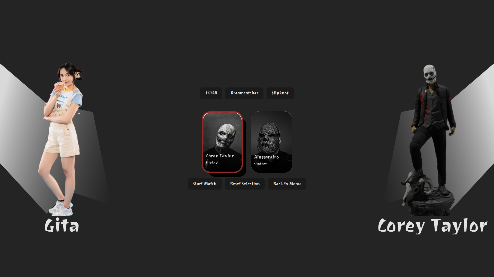

# Tic Game

React JS Tic Tac Toe Game tutorial with adding character selection and leaderboard. *(This is my old learning project with adding new feature, because my other github account banned).
  Link Deployment : [reactjs-ticgame.vercel.app](https://reactjs-ticgame.vercel.app)

## Library Used :
- Redux Toolkit
- React Router Dom
- Tailwind CSS

## Menu List :
- Game Start
- leaderboard
- Character List

## How To Play :
1. Select Game Start menu and you will navigate to character selection page, so you can select character you wanted for P1 and P2.
2. If you want to change your character before select click button reset selection. But after select your character for P1 and P2 you can click button start match
3. It has 2 condition when you end the match, first is draw when all squares is filled by your character. And the second condition is match end with winner.

## Leaderboard System
- Match recorded with all condition but when it come to leaderboard it counted only for winners.

## Some Screenshots

